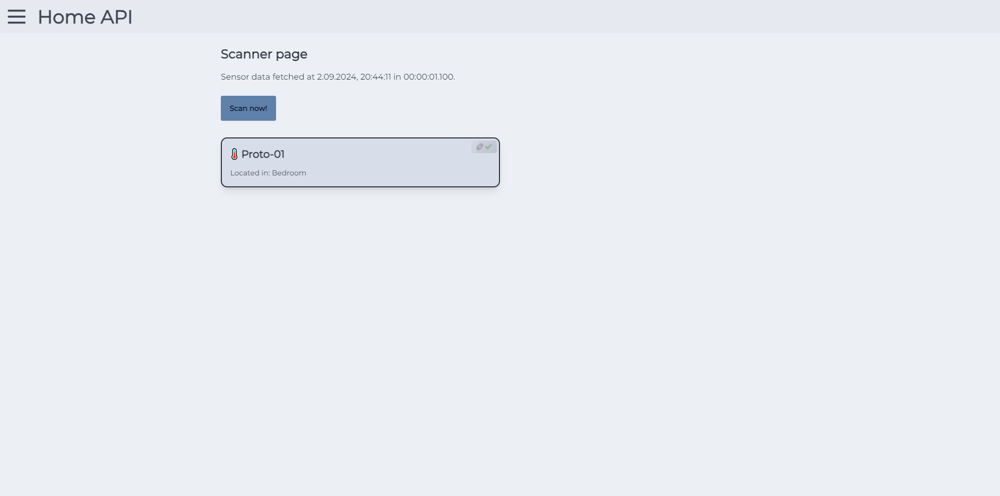
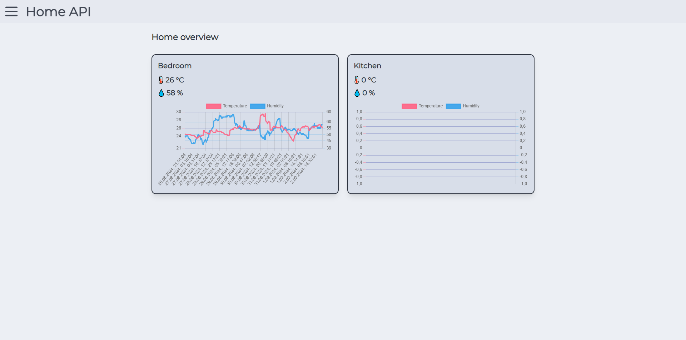
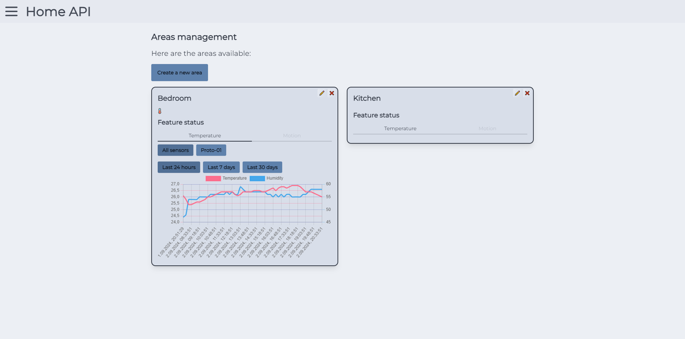

# Home API

The **Home API** is the core component of the **Home App**, designed to provide seamless management and interaction with various home sensors. It serves as the backend system that powers the Home App, handling the discovery, management, and organization of sensors throughout your home.

## Key Features

- **Sensor Discovery and Management**: Automatically discover and manage a wide range of sensors within your home. Easily add, remove, and configure sensors to suit your needs.



- **Web Interface**: The Home API hosts a built-in web page that allows users to interact with their smart home environment. Through this interface, users can monitor sensor data, configure settings, and view reports.



- **Real-Time Data Visualization**: The Home API presents temperature and humidity data through interactive charts. Users can assign sensors to specific areas of their home, making it easy to monitor conditions in different rooms or zones.



- **Future-Proof Design**: While the Home API currently supports temperature and humidity sensors, it is designed with scalability in mind. Additional sensor features and data types will be supported in future updates, ensuring that your smart home system remains cutting-edge.

## Upcoming Features

- **Expanded Sensor Support**: Future updates will introduce support for more sensor types, such as motion detectors, air quality monitors, and more.

- **Enhanced Data Insights**: Advanced analytics and reporting features will be added, allowing users to gain deeper insights into their home's environment.

- **Customizable Alerts**: Set up personalized notifications and alerts based on sensor data, ensuring you are always informed of important changes in your home environment.

The Home API is the backbone of a powerful and flexible smart home system, providing a centralized hub for all your sensor data and interactions.

## Building

### Prerequisites

Before building the Home API, ensure you have the following installed on your system:

- **Rust and Cargo**: You can install Rust and Cargo by following the instructions on the [official Rust website](https://www.rust-lang.org/tools/install).
- **Git**: Required to clone the repository. You can install Git from [here](https://git-scm.com/downloads).

### Building the Home API

Follow these steps to build the Home API from the source:

1. **Clone the Repository**:
   ```bash
   git clone https://github.com/your-username/home-api.git
   cd home-api
   ```

2. **Set the API_SECRET Environment Variable**:

   The `API_SECRET` environment variable is required to run the Home API. Set it in your terminal as follows:

   ```bash
   export API_SECRET=your_secret_key
   ```

   Replace `your_secret_key` with your desired secret key.

3. **Build the Project**:

   Use Cargo to build the Home API:

   ```bash
   cargo build --release
   ```

   This command compiles the project in release mode, optimizing it for performance.

4. **Run the Application**:

   After building, you can run the Home API with:

   ```bash
   cargo run --release
   ```

   The application will start, and the web interface will be accessible via your local network.

## Obtaining Pre-Built Executables

If you prefer not to build the Home API from source, pre-built executables are available for download from the [GitHub Releases page](https://github.com/your-username/home-api/releases). The pre-built versions are ready to run and do **not** require setting the API_SECRET environment variable.

Simply download the appropriate version for your operating system, extract the files if necessary, and run the executable to start using the Home API immediately.
